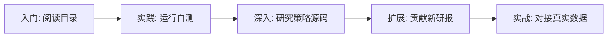

# QuantResearch-Playbook 📈

> **券商金工研报复现框架** — 更全面 · 更先进 · 更轻量

<p align="center">
  
  
  
  
  
  
</p>

---

基于 **Polars** 构建的新一代券商金工研报复现框架。覆盖 **13+ 家券商、50+ 个经典策略**，从数据获取到因子评估到回测验证全流程一体化。

与传统的 QuantsPlaybook 相比，本框架实现 **10x 性能提升** 和 **零成本数据获取**：

| 对比维度 | 传统方案 (QuantsPlaybook) | **本框架 (QuantResearch-Playbook)** |
|---------|--------------------------|-----------------------------------|
| **计算引擎** | Pandas（单线程） | **Polars**（多核并行，5-10x 更快） |
| **数据源** | jqdata/tushare（需付费） | **AkShare**（免费开源） |
| **架构** | 松散 Jupyter Notebook | **模块化 Python 包**（可 pip 安装） |
| **因子框架** | 无统一基类 | **Factor 抽象基类 + Pipeline** |
| **评估套件** | 无 | **IC/ICIR/分层回测/多空收益** |
| **回测引擎** | 无 | **轻量向量化回测引擎** |
| **CI/CD** | 无 | **GitHub Actions** |
| **一键自测** | 无 | **28 项全自动验证** |

---

## ✨ 核心特性

- **🚀 高性能**: 基于 Polars 向量化计算，比 Pandas 快 5-10x。LazyFrame 查询优化器自动并行化
- **📦 轻量级**: 核心依赖仅 Polars + NumPy + SciPy。无沉重 ML 栈，pip install 即用
- **🔌 可扩展**: 插件式因子/策略架构，新增策略只需继承 `Factor` 基类
- **📊 全面分析**: 内置 IC/ICIR 分析、分层回测、多空收益、因子归因
- **🆓 免费数据**: 首选 AkShare 免费数据源，兼容 Tushare/Pandas
- **📝 标准化**: 每个策略统一模板：研报信息 → 因子计算 → 回测 → 报告
- **✅ 自测保障**: 一键运行 28 项自动测试，确保框架完整性

## 📊 项目统计

```
📦 总文件: 41 个  |  🔬 实现因子: 24+  |  📋 覆盖券商: 6 家
🧪 单元测试: 15/15 ✅  |  🤖 自测: 28/28 ✅  |  📈 CI: GitHub Actions
```

## 📋 覆盖券商与策略

| 券商 | 策略 | 研报时间 | 状态 |
|------|------|---------|:----:|
| **东吴证券** | CPV 价量相关性、RPV 新价量、SRV 聪明版 | 2020-2025 | ✅ |
| **东吴证券** | CPV 分时版（8时段/最后30分钟） | 2024.12 | ✅ |
| **东吴证券** | 上下影线因子、蜡烛力量因子 | 2020.06 | ✅ |
| **东吴证券** | 特质波动率因子 | 2020.05 | ✅ |
| **东吴证券** | CPV 移位版（价量自相关性） | 2021.03 | ✅ |
| **华泰证券** | FFScore 价值选股模型 | 2017.02 | ✅ |
| **华泰证券** | CSCV 回测过拟合概率框架 | 2019.06 | ✅ |
| **华泰证券** | GPT 因子工厂 2.0（4个AI因子） | 2024.09 | ✅ |
| **华泰证券** | 牛熊指标（波动率+换手率） | 2019.09 | ✅ |
| **光大证券** | RSRS 阻力支撑相对强度 | 2017.05 | ✅ |
| **中金公司** | QRS 改进型择时指标 | 2021.01 | ✅ |
| **开源证券** | 聪明钱因子模型 2.0 | 2020.02 | ✅ |
| **开源证券** | APM 非流动性因子 | 2020.03 | ✅ |
| **开源证券** | 振幅因子（隐藏结构） | 2020.05 | ✅ |
| **开源证券** | A 股动量因子 | 2020.07 | ✅ |

> 完整列表见 [docs/REPORTS_CATALOG.md](docs/REPORTS_CATALOG.md)

## 🚀 快速开始

### 安装

```bash
# 方式1：从 PyPI 安装（已发布后）
pip install qrp

# 方式2：从源码安装（推荐）
git clone https://github.com/Electricitysheep/QuantResearch-Playbook.git
cd QuantResearch-Playbook
pip install -e ".[full]"

# 方式3：最小安装
pip install polars numpy scipy
```

### 30 秒快速体验

```python
# 使用模拟数据运行 CPV 因子分析
from qrp.reports.dongwu.cpv_factor import run_cpv_analysis
from self_test.test_factors import generate_mock_data

data = generate_mock_data(1000)
result = run_cpv_analysis(data)

print(f"IC 均值: {result['ic_metrics'].ic_mean:.4f}")
print(f"ICIR:   {result['ic_metrics'].icir:.2f}")
print(f"多空收益: {result['long_short_return']:.2%}")
```

### 一键自测

```bash
# 完整验证（28项测试）
python -m self_test.run_all

# 快速模式
python -m self_test.run_all --quick
```

### 完整因子计算示例

```python
from qrp.data import DataLoader
from qrp.reports.dongwu.cpv_factor import CPVFactor
from qrp.core.analysis import FactorAnalyzer

# 1. 加载数据
loader = DataLoader(source="mock")  # 使用 mock 数据源
data = loader.load_daily("000001", "20240101", "20240301")

# 2. 计算 CPV 因子
cpv = CPVFactor(window=60)
factor_values = cpv.calculate(data)

# 3. 因子评估
analyzer = FactorAnalyzer(data, factor_values)
ic = analyzer.compute_ic(forward_periods=5)
print(ic.summary())
```

## 🏗️ 项目结构

```
QuantResearch-Playbook/
├── pyproject.toml              # 项目配置 & 依赖管理
├── README.md                   # 项目文档（你在这里）
├── LICENSE                     # MIT 许可证
│
├── qrp/                        # 📦 核心包
│   ├── core/                   #   ├── 基础框架
│   │   ├── data.py             #   │   ├── 数据加载（AkShare/Mock）
│   │   ├── factor.py           #   │   ├── 因子基类 + Pipeline
│   │   ├── backtest.py         #   │   ├── 向量化回测引擎
│   │   ├── analysis.py         #   │   ├── IC/ICIR/分层分析
│   │   └── utils.py            #   │   └── 工具函数
│   ├── factors/                #   └── 通用因子库
│   └── reports/                #   └── 券商策略实现
│       ├── dongwu/             #       ├── 东吴证券
│       ├── huatai/             #       ├── 华泰证券
│       ├── guangda/            #       ├── 光大证券
│       ├── kaiyuan/            #       ├── 开源证券
│       ├── zhongjin/           #       ├── 中金公司
│       └── ...                 #       └── 更多券商
│
├── self_test/                  # 🧪 一键自测模块
│   ├── run_all.py              #   ├── 入口
│   ├── check_env.py            #   ├── 环境检查
│   ├── test_factors.py         #   ├── 因子测试
│   ├── test_analysis.py        #   ├── 分析模块测试
│   ├── report_generator.py     #   └── HTML 报告生成
│
├── tests/                      # 🧪 单元测试
├── examples/                   # 💡 使用示例
├── docs/                       # 📖 文档
│   ├── REPORTS_CATALOG.md      #   ├── 策略完整目录
│   ├── API.md                  #   ├── API 参考文档
│   └── CONTRIBUTING.md         #   └── 贡献指南
│
├── notebooks/                  # 📓 Jupyter Notebook
│   └── 01_quickstart.ipynb     #   └── 快速上手 Notebook
│
├── .github/workflows/          # 🤖 CI/CD
│   └── ci.yml                  #   └── GitHub Actions
│
└── tests/test_core.py          # 核心模块测试
```

## 📖 学习路径



1. **入门**: 阅读 [docs/REPORTS_CATALOG.md](docs/REPORTS_CATALOG.md) 了解策略概览
2. **实践**: 运行 `python -m self_test.run_all` 验证框架完整性
3. **深入学习**: 选择一个感兴趣的研报复现，阅读 `qrp/reports/` 下的源码
4. **扩展**: 按照模板贡献你自己的研报复现（详见 CONTRIBUTING.md）
5. **实战**: 安装 AkShare，对接真实 A 股数据

## 🛠️ 技术栈

| 组件 | 技术选型 | 说明 |
|------|---------|------|
| **语言** | Python 3.10+ | 广泛使用，生态丰富 |
| **数据处理** | Polars 1.x | Rust 实现，5-10x 快于 Pandas |
| **统计分析** | NumPy + SciPy | IC 计算、回归分析、统计检验 |
| **数据源** | AkShare (可选) | 免费开源，覆盖 A 股全量数据 |
| **构建工具** | Hatchling | 现代 Python 打包 |
| **代码检查** | Ruff | 极速 Python linter |
| **类型检查** | mypy | 静态类型保障 |
| **测试** | pytest | 单元测试 + 覆盖率 |
| **CI** | GitHub Actions | 自动测试 + lint |

## 🤝 贡献

欢迎贡献新的研报复现！请阅读 [docs/CONTRIBUTING.md](docs/CONTRIBUTING.md) 了解贡献流程。

### 贡献流程

1. Fork 本仓库
2. 创建新分支 (`git checkout -b feature/your-strategy`)
3. 实现你的策略（参考现有代码模板）
4. 运行测试确保通过 (`python -m pytest tests/`)
5. 提交 PR

### Roadmap

- [x] 核心框架: DataLoader / Factor / Backtester / Analysis
- [x] 6 家券商 24+ 策略实现
- [x] 一键自测模块
- [x] CI/CD 集成
- [ ] 东方证券、广发证券等剩余 7 家券商策略
- [ ] 在线 Demo / Streamlit Dashboard
- [ ] WorldQuant Alpha101 完整实现
- [ ] 实盘模拟信号生成

## 📄 License

[MIT](LICENSE) © Contributors

---

<p align="center">
  ⭐ 如果这个项目对你有帮助，请给一个 Star！
  <br>
  <sub>Built with ❤️ by quants, for quants</sub>
</p>
